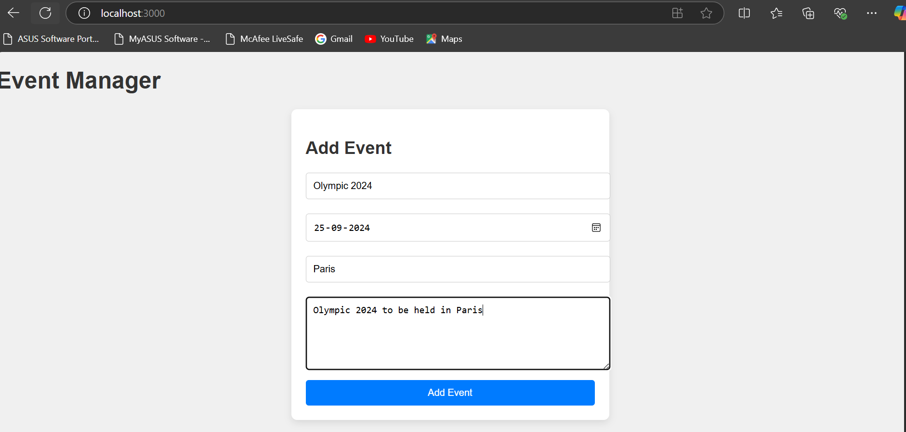
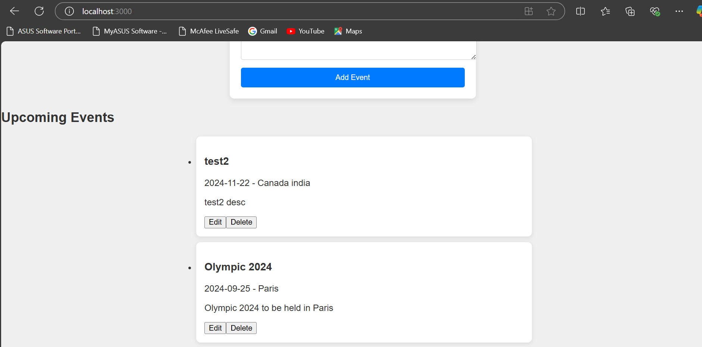
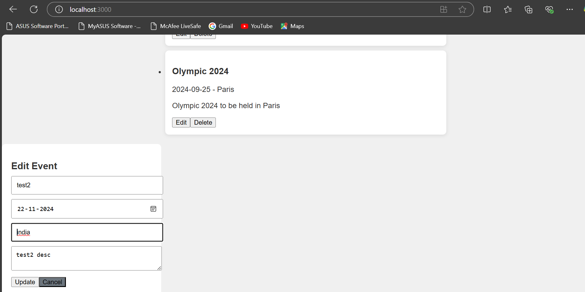

Event Management App
-------------------------
This is a full-stack web application that allows users to create, read, update, and delete (CRUD) events. 

Features
-------------------------
1. Create, read, update, and delete events.
2. Frontend built with React.js, TypeScript, and CSS.
3. Backend API built with Node.js and TypeScript.
4. In-memory data storage (no database).
5. Modular and scalable code structure.

Prerequisites
-------------------------
Ensure you have the following installed:
1. Node.js
2. npm

Getting Started
-------------------------
Follow these steps to set up and run the project.

1. Clone the Repository
2. Install Dependencies
    cd server
    npm install    
    cd client
    npm install
3. Run the Application
    Start the Backend Server
        cd server
        npm run dev
        The backend server will be running on http://localhost:5000
    Start the Frontend
        cd client
        npm start
        The frontend will be running on http://localhost:3000
4. Open the Application
    Navigate to http://localhost:3000 in your browser to view the application.  

API Endpoints
-------------------------
    The backend exposes the following API endpoints:
1. GET /api/events - Get all events.
2. POST /api/events - Create a new event.
3. PUT /api/events/:id - Update an event by ID.
4. DELETE /api/events/:id - Delete an event by ID

Frontend UI Flow
-------------------------
1. Create Event: Users can add a new event using the form in EventForm.tsx.
2. View Events: All events are listed in EventList.tsx.
3. Edit Event: Users can edit an event by clicking the "Edit" button, which opens the EventEditModal.tsx.
4. Delete Event: Users can delete an event by clicking the "Delete" button.    

Folder Structure
-------------------------
fullstack-event-app/
├── client/               # Frontend (React)
│   ├── public/
│   └── src/
│       ├── components/
│       │   ├── EventForm.tsx
│       │   ├── EventList.tsx
│       │   └── EventEditModal.tsx
│       ├── services/
│       │   └── api.ts
│       ├── App.tsx
│       ├── index.tsx
│       └── styles.css
├── server/               # Backend (Node.js, TypeScript)
│   ├── controllers/
│   │   └── eventController.ts
│   ├── models/
│   │   └── eventModel.ts
│   ├── routes/
│   │   └── eventRoutes.ts
│   ├── index.ts
│   └── tsconfig.json
├── package.json
├── README.md
└── .gitignore

#Images
----------------------
###Add Events

###List Events

###Edit Events

